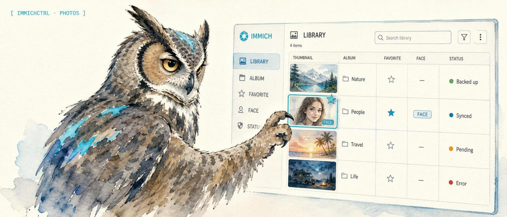

<p align="center">
  
</p>

<h1 align="center">immichctrl</h1>

<p align="center"><strong>An operator control CLI for Immich, with an MCP adapter so AI clients can search, curate, and clean up your self-hosted photo and video library through the same safe tool surface.</strong></p>

<p align="center">
  <a href="https://lidless.dev/immich-mcp"><strong>Website</strong></a>
  &nbsp;|&nbsp;
  <a href="https://www.npmjs.com/package/immich-mcp">npm</a>
  &nbsp;|&nbsp;
  <a href="https://immich.app">Immich</a>
</p>

<p align="center">
  
  
  
  
</p>

**What it is.** `immichctrl` is an operator control CLI for [Immich](https://immich.app), the self-hosted photo and video library. It gives shells, cron, CI, and automation agents a typed way to inspect your library, search assets, audit storage, and run common read-only workflows. The same package keeps the [Model Context Protocol](https://modelcontextprotocol.io) surface available through `immichctrl mcp` and the back-compat `immich-mcp` binary, so MCP clients like Claude Desktop, Claude Code, OpenClaw, or Codex CLI can browse and search your photo library, manage albums and tags, recognize people, surface memories, and resolve duplicates in plain language.

**Why use it.** Immich already holds your whole life in photos, but the web UI is built for clicking, not for repeatable operator workflows. `immichctrl` gives you scriptable commands like `immichctrl server stats`, `immichctrl search smart "sunset over the ocean"`, and `immichctrl duplicates`; the MCP adapter lets an AI client ask for the same kind of work through audited tool calls instead of hand-clicking.

**How it differs.** It is ctl-first and MCP-compatible: the package installs `immichctrl` for operator use, while `immichctrl mcp` and `immich-mcp` keep the full MCP adapter available. The MCP surface remains broad: 74 tools across 16 domains, including memories, duplicate detection with checksum-safe resolution, trash auditing, and motion-photo stacks that other Immich MCP servers do not cover. Writes are off by default and destructive calls demand explicit confirmation, so an agent cannot quietly delete your photos.

## What it does

`immichctrl` connects a self-hosted Immich photo library to operator workflows and MCP-compatible AI clients. The CLI covers read-only server, library, search, people, album, tag, duplicate, jobs, and memories workflows. The MCP adapter turns Immich's REST API into 74 typed, schema-validated tool calls grouped into 16 domains, so an MCP-compatible AI client can drive your photo and video library directly:

- **Search** your photo library by natural language (CLIP / smart search), by metadata (date, location, camera, people, tags), or by a server-side discovery feed.
- **Curate** albums, tags, shared links, and stacks (motion photos, bracketed shots, RAW + JPEG pairs).
- **Recognize people**: list recognized faces, rename them, merge duplicate face clusters, suggest names for unnamed clusters.
- **Surface memories**: "on this day" lanes, a today digest, and recent-upload summaries suitable for a daily cron drop.
- **Clean up duplicates and trash**: categorize duplicate groups, find byte-identical or CLIP-grouped dupes, audit the active library and trash for reclaimable space, and resolve with a configurable keep strategy.
- **Manage assets**: read metadata and EXIF, favorite, archive, rate, geotag, soft-delete (trash), restore, and upload from a confined local directory.

Reads always work. Writes and deletes only appear when you opt in, and the most destructive ones require a per-call `confirm: true`.

## Install

The MCP client config below uses `npx -y immich-mcp`, which needs no install and keeps the existing npm package name for compatibility. To install globally instead:

```bash
npm install -g immich-mcp
```

Or from source:

```bash
git clone https://github.com/lidless-labs/immichctrl.git
cd immichctrl
npm install
npm run build
```

When running from a source checkout, point your client's `command` at `node` and `args` at the absolute path to `dist/index.js`.

## Quickstart

```bash
# 1. Get an Immich API key: Account Settings > API Keys > New API Key in the Immich web UI.

# 2. Run a CLI check without installing globally:
IMMICH_BASE_URL=https://photos.example.com/api \
IMMICH_API_KEY=your_key_here \
npm exec --yes --package immich-mcp -- immichctrl ping
```

After a global install, the operator CLI is available as `immichctrl`. To start the MCP adapter instead, use `immichctrl mcp` or the back-compat `immich-mcp` binary. MCP launchers can keep using the config below.

## MCP client config

Copy this into your MCP client. It uses `npx -y immich-mcp` so there is nothing to install globally:

```json
{
  "mcpServers": {
    "immich-mcp": {
      "command": "npx",
      "args": ["-y", "immich-mcp"],
      "env": {
        "IMMICH_BASE_URL": "https://photos.example.com/api",
        "IMMICH_API_KEY": "YOUR_KEY",
        "IMMICH_ALLOW_WRITES": "false"
      }
    }
  }
}
```

- **Claude Desktop**: add the block above to `~/Library/Application Support/Claude/claude_desktop_config.json` (macOS) or `%APPDATA%\Claude\claude_desktop_config.json` (Windows), then restart Claude.
- **Claude Code**:

  ```bash
  claude mcp add immich-mcp \
    -e IMMICH_BASE_URL=https://photos.example.com/api \
    -e IMMICH_API_KEY=YOUR_KEY \
    -e IMMICH_ALLOW_WRITES=false \
    -- npx -y immich-mcp
  ```

  Add `--scope user` to make it available from any directory.
- **OpenClaw**: add the same `command` / `args` / `env` under `mcps.entries.immich-mcp` in `~/.openclaw/openclaw.json`, then `systemctl --user restart openclaw-gateway` and `openclaw mcp list` to confirm.
- **Codex CLI**: add a `[mcp_servers.immich-mcp]` block to `~/.codex/config.toml`:

  ```toml
  [mcp_servers.immich-mcp]
  command = "npx"
  args = ["-y", "immich-mcp"]
  env = { IMMICH_BASE_URL = "https://photos.example.com/api", IMMICH_API_KEY = "YOUR_KEY", IMMICH_ALLOW_WRITES = "false" }
  ```

Prefer a global install or a source checkout? See [Install](#install).

## Tools

74 tools across 16 domains. Tools marked *(requires `confirm: true`)* are destructive and refuse to run without an explicit confirm flag on the call; all write and delete tools additionally require `IMMICH_ALLOW_WRITES=true`.

### System (5)
- `immich_ping` - verify connectivity, return server pong
- `immich_get_server_info` - server config (login page, OAuth, theme)
- `immich_get_server_statistics` - photo, video, and user counts plus per-user storage
- `immich_get_capabilities` - enabled features (search, ML, OAuth)
- `immich_get_storage` - storage used, available, total, and template

### Assets (11)
- `immich_list_assets` - paginated list/search with filters (favorite, archived, date, type, person, album, tag)
- `immich_get_asset` - full metadata for one asset
- `immich_get_asset_exif` - EXIF / IPTC block for an asset
- `immich_get_asset_statistics` - per-user image and video counts
- `immich_download_asset_original` - Immich URL path for the original file
- `immich_download_asset_thumbnail` - Immich URL path for the thumbnail
- `immich_upload_asset_from_path` - upload a local file *(confined to `IMMICH_UPLOAD_BASE_DIR`; refused when unset)*
- `immich_update_asset` - description, favorite, archive, rating, date, geotag
- `immich_bulk_update_assets` - bulk favorite / archive / visibility *(requires `confirm: true`)*
- `immich_delete_asset` - soft delete (trash) by default; `permanent: true` bypasses trash *(permanent requires `confirm: true`)*
- `immich_restore_from_trash` - restore previously trashed assets

### Search (3)
- `immich_search_smart` - CLIP / semantic search by natural-language query
- `immich_search_metadata` - structured search (date, location, camera, people, tags, albums)
- `immich_search_explore` - random sample for discovery / "explore" lanes

### Albums (8)
- `immich_list_albums`
- `immich_get_album`
- `immich_get_album_statistics`
- `immich_create_album`
- `immich_update_album` - rename, set cover, set description
- `immich_add_assets_to_album`
- `immich_remove_assets_from_album`
- `immich_delete_album` - assets are NOT deleted *(requires `confirm: true`)*

### Album flows (1)
- `immich_search_then_album` - run a smart or metadata search, then create an album from the matches *(writes-gated)*

### People (7)
- `immich_list_people`
- `immich_get_person`
- `immich_get_person_assets` - photos and videos a face appears in
- `immich_update_person` - name, birthdate, visibility, favorite, feature face
- `immich_hide_person` - exclude from default lists without deleting
- `immich_merge_people` - fold duplicate face clusters into one *(requires `confirm: true`)*
- `immich_suggest_face_names` - top unnamed people by face count, for triage

### Tags (7)
- `immich_list_tags`
- `immich_get_tag`
- `immich_create_tag`
- `immich_update_tag` - rename or recolor
- `immich_delete_tag` *(requires `confirm: true`)*
- `immich_add_tag_to_assets`
- `immich_remove_tag_from_assets`

### Shared links (5)
- `immich_list_shared_links`
- `immich_get_shared_link`
- `immich_create_shared_link`
- `immich_update_shared_link`
- `immich_delete_shared_link` *(requires `confirm: true`)*

### Activities (4)
- `immich_list_activities` - comments and likes on albums or assets
- `immich_get_activity_statistics`
- `immich_create_activity`
- `immich_delete_activity` *(requires `confirm: true`)*

### Memories (2)
- `immich_list_memories` - memory lanes ("years ago", etc.)
- `immich_get_memory`

### Memory flows (2)
- `immich_memories_today` - today's "X years ago" lanes, chat-formatted
- `immich_daily_digest` - server stats + today's memories + recent uploads as a markdown drop

### Duplicates (2)
- `immich_list_duplicates` - duplicate groups detected by Immich's hashing pass
- `immich_resolve_duplicates` - keep[] / discard[], dry-run by default *(`delete: true` + `confirm: true` to remove)*

### Duplicate flows (8)
- `immich_categorize_duplicates` - bin duplicate groups (checksum-exact, name-size, resolution variants, bursts, edits)
- `immich_find_byte_dupes` - ready-to-trash candidates with a `safetyMode` (strict-checksum default)
- `immich_resolve_with_keep_strategy` - end-to-end dedupe, dry-run by default, album-aware
- `immich_explain_duplicate_group` - per-asset detail and a recommended keeper with rationale
- `immich_find_clip_dupes` - visual-but-not-byte-identical CLIP-grouped pairs (read-only)
- `immich_compare_assets` - side-by-side metadata diff of 2-10 assets with a recommendation
- `immich_audit_active` - reclaimable duplicate candidates still in the active library
- `immich_audit_trash` - cross-check trashed assets against the active library for orphans

### Stacks (4)
- `immich_list_stacks` - stack groups (motion photos, bracketed shots, RAW + JPEG pairs)
- `immich_create_stack`
- `immich_update_stack` - reassign the primary asset
- `immich_delete_stack` - assets stay *(requires `confirm: true`)*

### Trash (3)
- `immich_list_trash` - paginated trashed assets, scoped to trash
- `immich_restore_by_query` - restore trashed assets matching a filter *(no filter requires `confirm: true`)*
- `immich_empty_trash` - permanently delete EVERYTHING in trash, NOT REVERSIBLE *(requires `confirm: true`)*

### Jobs (2)
- `immich_list_jobs` - queue status for background jobs (thumbnails, ML, metadata, sidecar)
- `immich_run_job` - send a command to a background job *(destructive commands require `confirm: true`)*

## Configuration

Set these environment variables in your shell or MCP client config:

| Variable | Required | Default | Description |
|----------|----------|---------|-------------|
| `IMMICH_BASE_URL` | yes | - | Base URL of your Immich API, e.g. `https://photos.example.com/api` (or `http://192.0.2.10:2283/api` for a LAN host). |
| `IMMICH_API_KEY` | yes | - | API key from Account Settings > API Keys in the Immich web UI. |
| `IMMICH_ALLOW_WRITES` | no | `false` | Set to `true` to expose write and delete tools. Reads always work. |
| `IMMICH_VERIFY_SSL` | no | `true` | Set to `false` to accept self-signed certs. The relaxed TLS check is scoped to the Immich client only (a dedicated request dispatcher); it does **not** disable certificate validation process-wide. |
| `IMMICH_UPLOAD_BASE_DIR` | no | - | Absolute directory that `immich_upload_asset_from_path` is confined to. When unset, path-based upload is refused. Files must resolve (after following symlinks) inside this directory. |

### Getting an API key

1. Log into Immich.
2. Account Settings > API Keys > New API Key.
3. Name it (e.g. `mcp`) and copy the value.

## CLI

`immichctrl` is the primary operator interface for shells, cron, and CI. It shares the `@immich/sdk` core with the MCP adapter and reads the same `IMMICH_BASE_URL` / `IMMICH_API_KEY` env config. It exposes only the read tools (server, library, and search lookups); every write, delete, upload, and job-control tool stays in the MCP surface behind the `IMMICH_ALLOW_WRITES` gate and is unreachable from the CLI.

```bash
npm exec --yes --package immich-mcp -- immichctrl ping
# or, installed globally:
immichctrl ping
immichctrl server stats
immichctrl storage
immichctrl capabilities
immichctrl albums list
immichctrl albums get 00000000-0000-0000-0000-000000000001
immichctrl assets list --type image --favorite --size 20
immichctrl assets stats
immichctrl people list --with-hidden
immichctrl tags list
immichctrl duplicates
immichctrl jobs
immichctrl memories --saved
immichctrl search metadata --city Madrid --type image
immichctrl search smart "sunset over the ocean"
immichctrl server stats --json        # raw JSON for piping
```

Run `immichctrl help` for the full command and flag list. `--json` emits raw JSON instead of the concise human-readable summary. Exit codes: `0` success, `1` runtime error (Immich unreachable / call failed), `2` usage error (unknown command/flag or bad value).

Point `IMMICH_BASE_URL` at your Immich API, e.g. `https://photos.example.com/api` (or `http://192.0.2.10:2283/api` for a LAN host).

### Starting the MCP adapter

`immichctrl mcp` (or the back-compat `immich-mcp` bin) starts the stdio MCP adapter. If a launcher referenced the file path `dist/index.js` directly, it keeps working; new launchers can point at `dist/mcp-bin.js` (or `dist/cli.js mcp`). Launchers that use the `immich-mcp` bin name need no change.

## Example prompts

> Show me memories from this week.

Calls `immich_memories_today` / `immich_list_memories` and filters by the current week.

> Find duplicate photos and tell me which to delete (don't delete yet).

Calls `immich_categorize_duplicates` / `immich_list_duplicates` and returns clusters as a dry run, without resolving anything.

> Group these motion photos into a stack.

Calls `immich_create_stack` with the asset IDs and a primary pick.

> Make an album of every beach photo from last August.

Calls `immich_search_then_album` to search and create the album in one writes-gated step.

## Safety model

`immichctrl` and its MCP adapter are designed to be safe to hand to automation:

- **Reads are always allowed. Writes are opt-in.** Write and delete tools only register when `IMMICH_ALLOW_WRITES=true`.
- **Destructive calls require an explicit `confirm: true`.** Bulk updates, permanent deletes, merges, emptying trash, and similar refuse to run otherwise, even with writes enabled.
- **Dry-run by default for dedupe.** Resolution tools report what they would do before they touch anything.
- **Path-based upload is confined.** `immich_upload_asset_from_path` only reads inside `IMMICH_UPLOAD_BASE_DIR` (after resolving symlinks), and is refused entirely when that variable is unset.
- **Relaxed TLS is scoped.** `IMMICH_VERIFY_SSL=false` only relaxes the Immich client's dispatcher; it does not weaken certificate validation for the rest of the process.

## Why not the other options?

- **The Immich web UI** is built for clicking through a grid. It is great for browsing and awkward for repeatable "do X across thousands of photos" operator workflows.
- **The Immich CLI** uploads and manages assets from scripts, but it is not an MCP adapter and an LLM cannot call it as typed tools. `immichctrl` focuses on operator reads, while `immichctrl mcp` and `immich-mcp` provide the MCP tool-call surface for an agent.
- **Other Immich MCP servers** tend to cover the basics (browse, search, albums). This one is broader: 74 tools spanning memories, motion-photo stacks, checksum-safe duplicate resolution, trash auditing, and job control, with a two-tier write-protection model built in.
- **Writing your own glue around the Immich REST API** works, but you would re-implement schema validation, pagination, write-gating, confirmation guards, and the dedupe safety logic that this server already ships and tests.

## What this package is not

- It is **not** a replacement for Immich. You still run your own Immich server; this connects an AI client to it.
- It is **not** a hosted service. The CLI runs locally, and the MCP adapter runs locally on stdio when launched by your MCP client. Nothing is sent anywhere except to the Immich server you point it at.
- It is **not** a photo editor or an ML model. It calls Immich's existing search, recognition, and dedup features; it does not run its own.
- It does **not** delete or modify anything unless you set `IMMICH_ALLOW_WRITES=true`, and the destructive tools still demand a per-call `confirm: true`.
- It is **not** an official Immich project. It is a community operator CLI and MCP adapter that uses the public Immich API.

## License

MIT - see [LICENSE](LICENSE).
